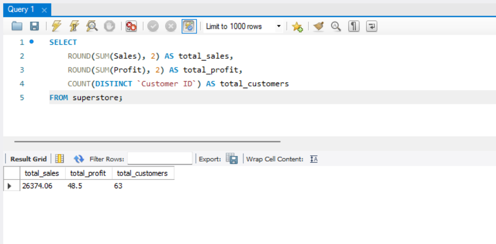
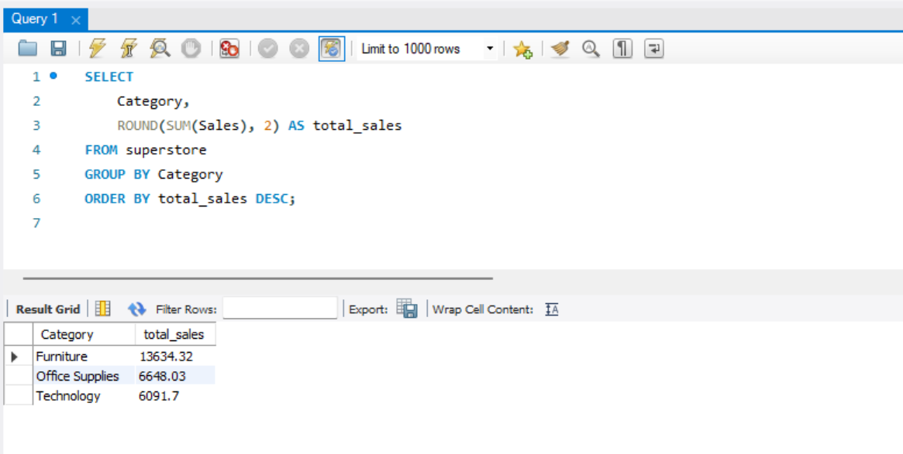
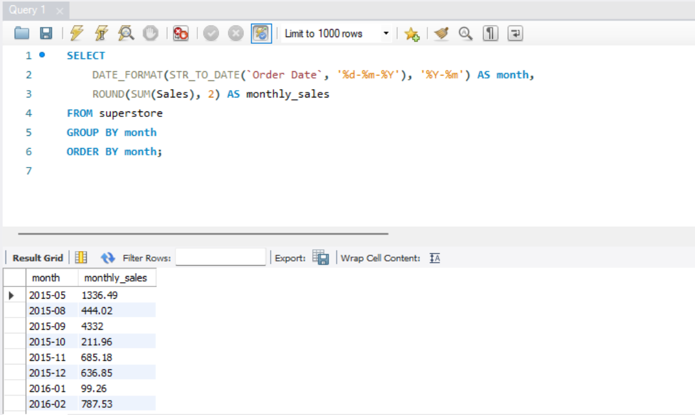
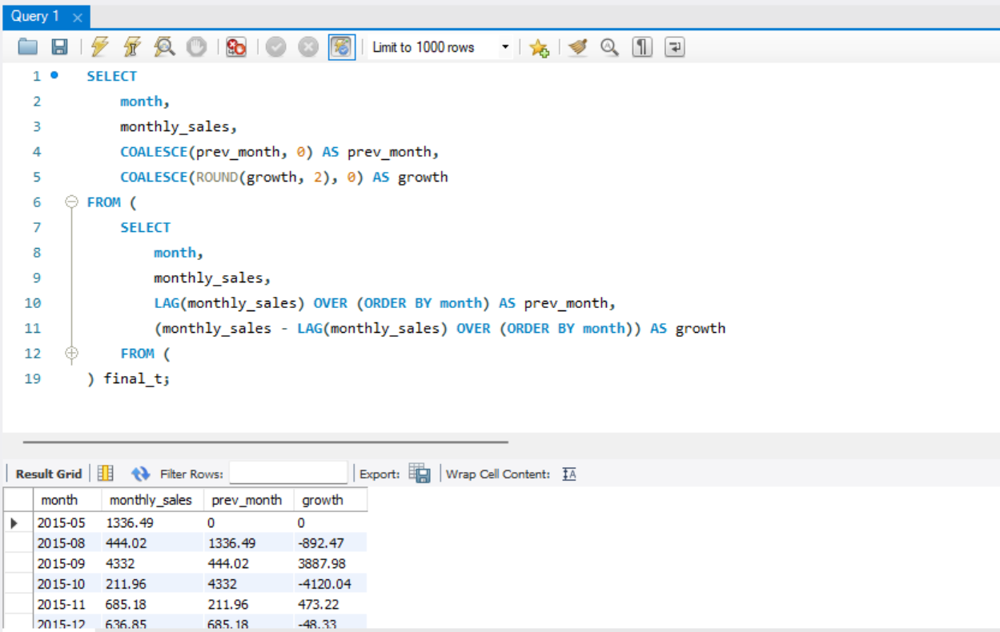
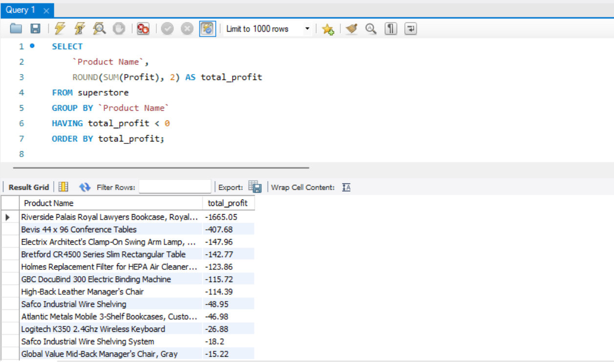
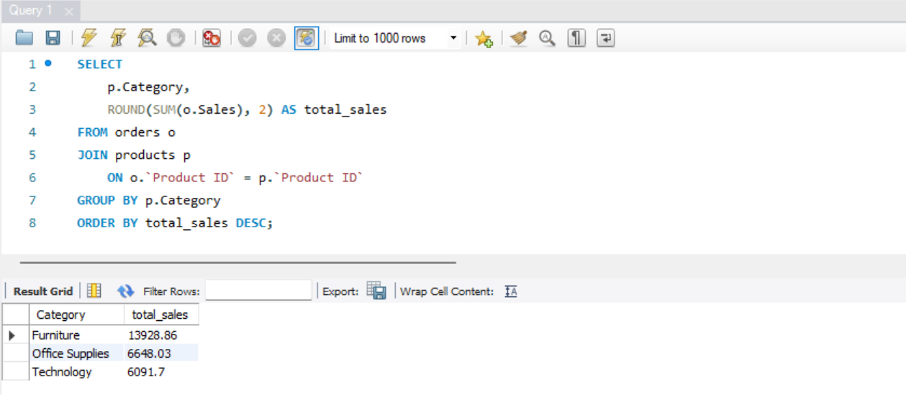
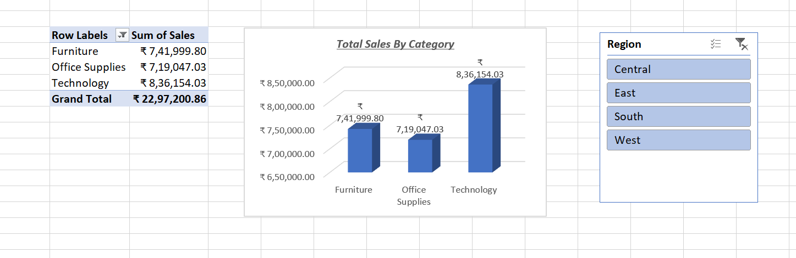
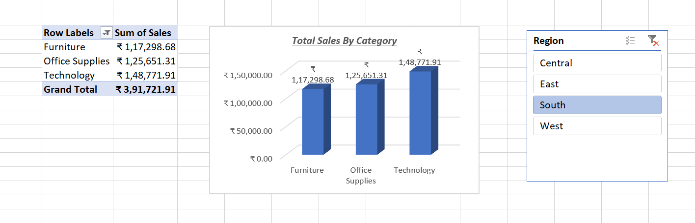
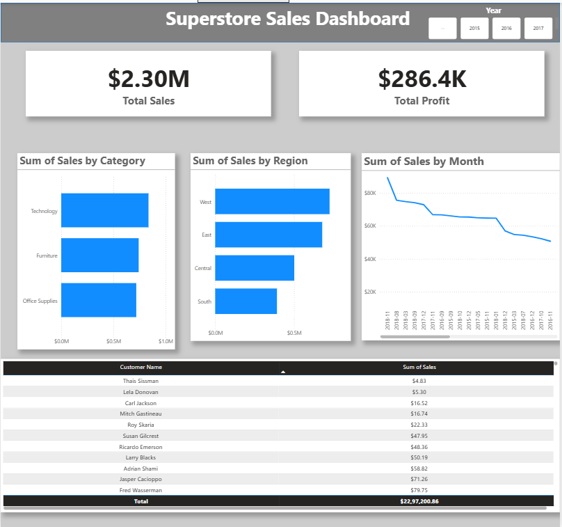
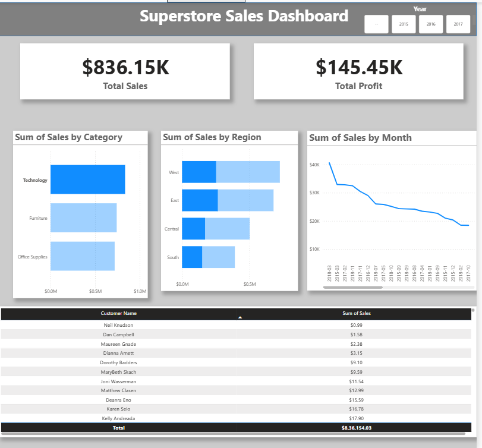

# 📊 Superstore Sales Analysis
End-to-end retail sales analysis using SQL, Excel, and Power BI to uncover business insights.

## 🚀 Project Highlights
- Built end-to-end sales analysis using SQL, Excel, and Power BI  
- Designed relational data model (Orders & Products)  
- Performed KPI and trend analysis using SQL  
- Created interactive dashboards for business insights

## 📌 Project Overview

This project analyzes retail sales data using SQL, Excel, and Power BI to uncover key business insights related to sales performance, customer behavior, and product profitability.
The analysis includes data modeling, KPI tracking, trend analysis, and interactive dashboarding to support data-driven decision-making.

## 📌 Business Problem Statement

Retail businesses often struggle to identify which products, categories, and regions drive profitability, and where losses are occurring.

The objective of this project is to analyze sales data to:

* Identify top-performing categories and products
* Detect loss-making products and potential pricing issues
* Analyze sales trends over time
* Evaluate regional performance differences
* Understand the impact of discounts on profitability

This analysis aims to provide actionable insights to support better decision-making in pricing, inventory management, and sales strategy.

The insights derived from this analysis can help stakeholders optimize revenue and improve overall profitability

## 📊 Dataset

The project utilizes a comprehensive retail dataset containing 10,000+ sales transactions. It includes granular details across order information, product categories, regional performance, and profitability metrics

The dataset used in this project is stored in the `data/` folder.

## 🛠️ Tools Used

* SQL (MySQL)
* Power BI
* Excel (for data handling)

## 🗂️ Data Modeling

The original dataset contained a single table. To simulate a real-world relational database, the data was split into two tables:

Orders Table

* Order ID
* Order Date
* Customer ID
* Customer Name
* Region
* Sales
* Profit
* Product ID

Products Table

* Product ID
* Product Name
* Category
* Sub-Category

The tables were joined using Product ID to enable relational analysis. 

## 📂 SQL Queries

The project includes structured SQL queries covering:

* KPI analysis (Sales, Profit, Customer metrics)
* Category-wise performance
* Monthly sales trends
* Month-over-Month (MoM) growth using window functions
* Identification of loss-making products
* Join-based analysis across multiple tables

All queries are available in the sales_analysis.sql file.

## 📂 SQL Outputs

### KPI Analysis
  
_Shows total sales, profit, and order count_

---

### Sales by Category
  
_Analyzes performance across product categories_

---

### Monthly Trend
  
_Tracks sales trend over time_

---

### Monthly Growth
  
_Month-over-month comparison_

---

### Loss-Making Products
  
_Identifies unprofitable products_

---

### Join Analysis
  
_Combines multiple tables for deeper insights_

## 📊 Excel Analysis

Excel was used to perform exploratory data analysis and build an interactive dashboard for category-wise and region-wise sales performance.

### Key Features:
- Pivot table for category-wise sales breakdown
- Interactive filters for region-level analysis
- Visual representation using charts

#### Overview

#### Interactive View

## 📊 Power BI Dashboard

The dashboard provides an interactive view of:

* Total Sales and Profit
* Sales by Category and Region
* Monthly Sales Trends
* Top Customers

## 📈 Key Insights

- Technology category generates the highest overall sales, indicating strong demand.
- Certain products consistently incur losses, suggesting pricing or discounting inefficiencies.
- Monthly sales trends show fluctuations, highlighting possible seasonality effects.
- Regional analysis reveals uneven contribution to overall profitability.
- Higher discount levels are correlated with reduced profit margins.

## 📷 Screenshots

### Dashboard Overview

### Interactive Dashboard

## 🚀 Conclusion

This project demonstrates strong skills in:
- SQL for data analysis  
- Data modeling and transformation  
- Dashboard creation using Power BI and Excel  

It provides actionable insights to improve:
- Pricing strategy  
- Product performance  
- Business profitability  
